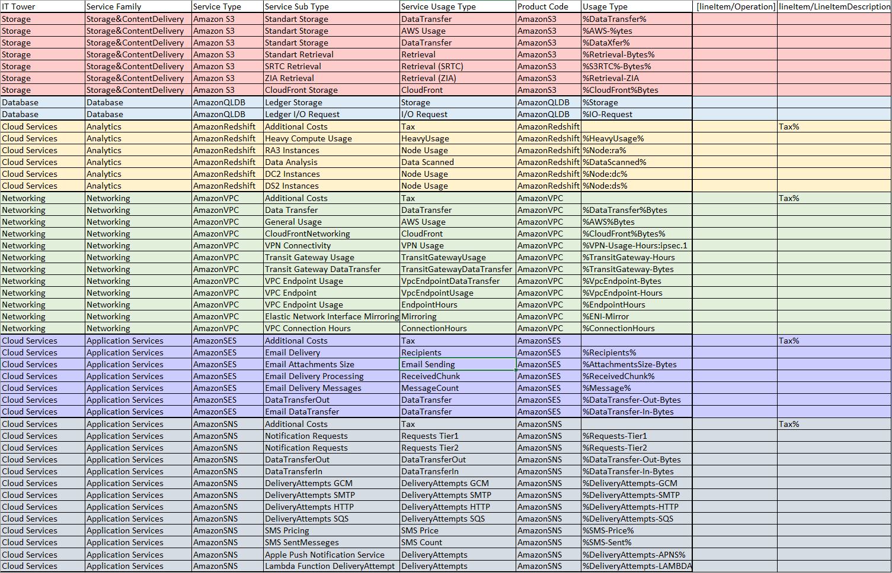

# Лабораторная работа 1. Знакомство с IaaS, PaaS, SaaS сервисами в облаке на примере Amazon Web Services (AWS). Создание сервисной модели.

## Вариант 10

## Цель работы:
1. Знакомство с облачными сервисами. 
2. Понимание уровней абстракции над инфраструктурой в облаке. 
3. Формирование понимания типов потребления сервисов в сервисной-модели. 

## Описание параметров таблицы:
   
| **Название**          | **Описание**                                                                                                                                                               |
|-----------------------|---------------------------------------------------------------------------------------------------------------------------------------------------------------------------|
| **IT Tower**          | Группа, ответственная за управление инфраструктурой сервиса, его поддержку и характеристику. Примеры: Storage, Database, Networking.      |
| **Service Family**    | Группа сервисов, которые выполняют похожие задачи и связаны с определёнными приложениями. Например: управление ресурсами, кэширование, защита от угроз, поддержка приложений. |
| **Service Type**      | Конкретная категория сервиса внутри одной группы.                                            |
| **Service Sub Type**  | Узкий подтип сервиса, предназначенный для выполнения конкретной функции. Например: ускорение, безопасность, работа с узлами кэша и т.д.                                    |
| **Service Usage Type**| Способ использования сервиса, который определяет, что может делать пользователь. Примеры: временное хранилище, редкий доступ к данным, расчёты и налоги.                     |
---

## Описание облачных сервисов AWS

### Amazon S3 
Amazon S3 (Amazon Simple Storage Service) — облачная система для хранение любого типа данных. Amazon S3 зачастую используется многими службами для хранения и хостинга файлов.

### Amazon QLDB
Amazon QLDB (Quantum Ledger Database) — это управляемая база данных, предназначенная для хранения и отслеживания изменений без возможности изменения истории. 

### Amazon Redshift 
AWS Redshift — это облачный сервис для хранения данных огромного масштаба и их дальнейшей аналитики. С помощбю данного сервиса можно удобно обрабатывать большое количество данных для принятия бизнес-решений.

### Amazon VPC  
Amazon VPC (Virtual Private Cloud) — сервис, позволяющий создать изолированную виртуальную сеть. С помощью данного сервиса можно контролировать все связи внутри сервера и управлять конфиденциальностью и безопасностью ваших облачных ресурсов.

### Amazon SES
AWS SES (Simple Email Service) — это облачный сервис отправки оповещений, рассылок, маркетинговых и транзакционных сообщений.

### Amazon SNS
Amazon SNS (Simple Notification Service) — сервис для отправке уведомлений пользователям или другим сервисам. Гарантирует высокую скорость и доставку в сложной сети.

## Результат работы

[Ссылка на таблицу.](https://docs.google.com/spreadsheets/d/1IdSkLBiZ4W_IvETwsc4px0lpon1d1MnS/edit?gid=931573506#gid=931573506)

## Вывод
В ходе выполнения лабораторной работы были проанализированы и описаны 6 сервисов Amazon, а также получены данные о подтипах этих сервисов и других характеристиках. Данная работа помогла мне понять, как эти технологии могут быть использованы для решения реальных задач, что поможет мне в будущем.
