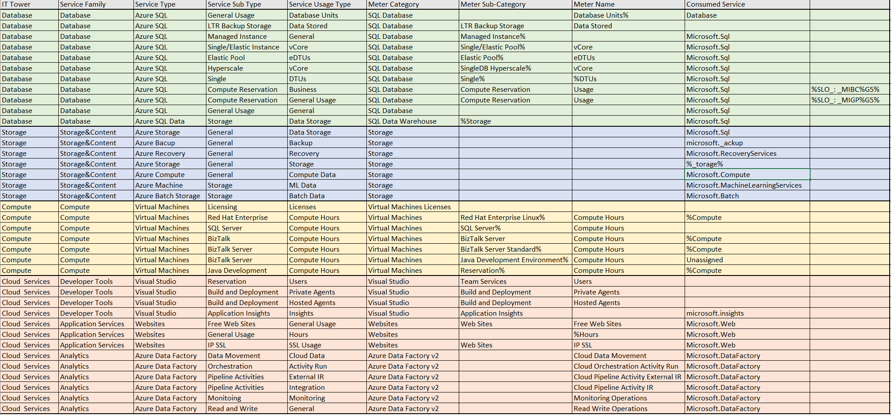

# Лабораторная работа 2. Сравнение сервисов Amazon Web Services и Microsoft Azure. Создание единой кросс-провайдерной сервисной модели.

## Вариант 7

## Цель работы:
1. Знакомство с облачными сервисами. 
2. Понимание уровней абстракции над инфраструктурой в облаке. 
3. Формирование понимания типов потребления сервисов в сервисной-модели. 

## Описание параметров таблицы:
   
| **Название**          | **Описание**                                                                                                                                                               |
|-----------------------|---------------------------------------------------------------------------------------------------------------------------------------------------------------------------|
| **IT Tower**          | Группа, ответственная за управление инфраструктурой сервиса, его поддержку и характеристику. Примеры: Storage, Database, Networking.     |
| **Service Family**    | Группа сервисов, которые выполняют похожие задачи и связаны с определёнными приложениями. Например: управление ресурсами, кэширование, защита от угроз, поддержка приложений. |
| **Service Type**      | Конкретная категория сервиса внутри одной группы.                                            |
| **Service Sub Type**  | Узкий подтип сервиса, предназначенный для выполнения конкретной функции. Например: ускорение, безопасность, работа с узлами кэша и т.д.                                    |
| **Service Usage Type**| Способ использования сервиса, который определяет, что может делать пользователь. Примеры: временное хранилище, редкий доступ к данным, расчёты и налоги.                     |
---

## Описание облачных сервисов 

### Azure SQL Database 
Azure SQL Database — это облачный сервис позволяющий управлять и масштабировать реляционные базы данных в облаке. Обеспечивает высокую доступность и безопасность.

### Azure SQL Data Warehouse
Azure SQL Data Warehouse — это сервис, который предназначен для анализа и обработки больших объемов данных. Позволяет интегрировать данные из различных источников и обрабатывать их с помощью разных инструментов.

### Azure Storage
Azure Storage — это облачный сервис, позволяющий безопасно хранить различных типов данные. Обеспечивает масштабируемое и надежное хранение с возможностью быстрого доступа.

### Azure Virtual Machines  
Azure Virtual Machines Licenses — сервис, позволяющий запускать виртуальные серверы с ОС Linus и Windows для выполнения различных задач, например, обработка данных или хостинг веб-сайтов.

### Azure Visual Studio
Azure Visual Studio — это интеграция Visual Studio с облачной платформой Microsoft Azure. Visual Studio предоставляет разработчикам инструменты для создания, развертывания и управления приложениями, используя облачные ресурсы Azure.

### Azure Websites
Azure Websites — это облачный сервис, созданный для хостинга приложений, API и мобильных сервисов. Предоставляет хорошие условия для развертывания приложений с высокими требованиями.

### Azure Data Factory v2
Azure Data Factory v2 (ADFv2) — облачный инструмент для управления процессами обработки и аналитики данных в облаке. Поддерживает интеграцию с различного рода ресурсами или источниками.

## Результат работы

[Ссылка на таблицу.](https://docs.google.com/spreadsheets/d/1w_clrSpzW4QYNQjQikMTCKlUgw5AM9sd/edit?gid=572191322#gid=572191322)

## Вывод
В ходе выполнения лабораторной работы были проанализированы и описаны 7 сервисов Azure, а также получены данные о подтипах этих сервисов и других характеристиках. Данная работа помогла мне понять, как эти технологии могут быть использованы для решения реальных задач, что поможет мне в будущем.
