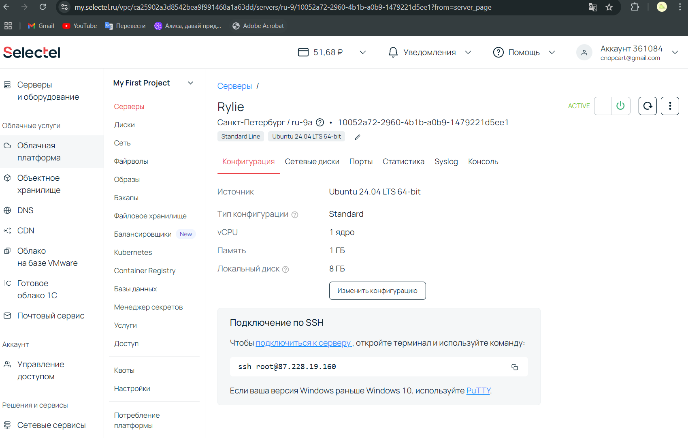
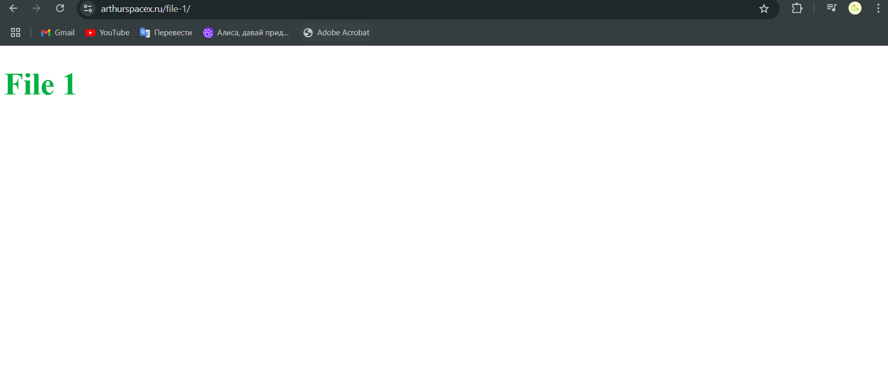
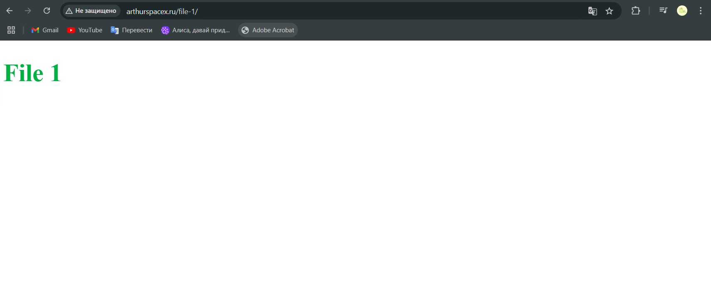

# Лабораторная работа по предмету "Облачные технологии и услуги"

## Техническое задание

1. **Должен работать по HTTPS с сертификатом**
   
2. **Настроить принудительное перенаправление HTTP-запросов (порт 80) на HTTPS (порт 443)**
   
3. **Использовать alias для создания псевдонимов путей к файлам или каталогам на сервере**
   
4. **Настроить виртуальные хосты для обслуживания нескольких доменных имен на одном сервере**
   
5. **Что угодно еще под требования проекта**

## Настройка nginx'а


- Арендуем облачный сервер и подключаемся к нему через SSH-ключ.



- Установили соединение с помощью SSH-Remote в VSC.
- Далее прописываем команды в терминале:

   ```bash
   sudo apt update
   ```

   ```bash
   sudo apt install git nginx 
   ```
и видим данную картину



Понимаем что nginx работает и двигаемся дальше.

- Преносим index-1.html и index-2.html нужные нам файлы в /var/www/File-1/ и /var/www/File-2/ 

- Немного изменям файл `default` и получаем

```nginx
    server {
    listen 80;
    server_name 87.228.19.160;

    location /file-1 {
        alias /var/www/file-1/;
        try_files $uri /index-1.html =404;
    }

    location / {
        alias /var/www/file-2/;
        try_files $uri /index-2.html =404;
    }

    error_page 404 /404.html;
    location = /404.html {
        root /var/www/html;
        internal;
    }
}
```

## Домен 

- Покупаем и подключаем наш домен к ip-адресу

```nginx 
    server {
        listen 80;
        server_name arthurspacex.ru;

        location /file-1 {
            alias /var/www/file-1/;
            try_files $uri /index-1.html =404;
        }

        location / {
            alias /var/www/file-2/;
            try_files $uri /index-2.html =404;
        }

        error_page 404 /404.html;
        location = /404.html {
            root /var/www/html;
            internal;
    }
}
```



## Получение SSL-сертификата

- Чтобы получить сертификат, мы будем использовать certbot. Для этого пропишем следующие команды в консоль:

```bash
    sudo apt-get remove certbot
```

```bash
    sudo apt-get install snapd
```

```bash
    sudo snap install --classic certbot
```

- Далее прописываем в корне системы и получаем сертификат: 

```bash
    sudo ln -s /snap/bin/certbot /usr/bin/certbot
```
    
```bash
    sudo certbot --nginx
```
    


- При получении сертификата certbot автоматически настроил файл
    
- Код конфигурации:

    ```nginx 
        server {
            listen 80;
            server_name arthurspacex.ru www.arthurspacex.ru;

            return 301 https://$host$request_uri;
        }

        server {
            listen 443 ssl;
            server_name arthurspacex.ru www.arthurspacex.ru;

            ssl_certificate /etc/letsencrypt/live/arthurspacex.ru/fullchain.pem; 
            ssl_certificate_key /etc/letsencrypt/live/arthurspacex.ru/privkey.pem; 
            include /etc/letsencrypt/options-ssl-nginx.conf; 
            ssl_dhparam /etc/letsencrypt/ssl-dhparams.pem; 

            location /file-1 {
                alias /var/www/file-1/;
                try_files $uri /index-1.html =404;
            }

            location / {
                alias /var/www/file-2/;
                try_files $uri /index-2.html =404;
            }

            error_page 404 /404.html;
            location = /404.html {
                root /var/www/html;
                internal;
            }
        }

    ```

## Подключение второго домена 

- Делаем все то же самое, что и с первым доменом

- Прописываем следующие команды:

    ```bash
    sudo certbot --nginx -d arthurspacex.ru -d www.arthurspacex.ru -d arthurspacex.online -d www.arthurspacex.online
    ```

- Рестартим nginx для получения сертификатов

    ```bash
    sudo systemctl restart nginx
    ```


- После чего код конфигурации меняется и становится таким:
    ```nginx
    server {
    if ($host = www.arthurspacex.ru) {
        return 301 https://$host$request_uri;
    } 


    if ($host = arthurspacex.ru) {
        return 301 https://$host$request_uri;
    }


    if ($host = www.arthurspacex.online) {
        return 301 https://$host$request_uri;
    }


    if ($host = arthurspacex.online) {
        return 301 https://$host$request_uri;
    }


    listen 80;
    server_name arthurspacex.ru www.arthurspacex.ru arthurspacex.online www.arthurspacex.online;

    return 301 https://$host$request_uri;
    }

    server {
        listen 443 ssl;
        server_name arthurspacex.ru www.arthurspacex.ru arthurspacex.online www.arthurspacex.online;
        ssl_certificate /etc/letsencrypt/live/arthurspacex.ru/fullchain.pem; 
        ssl_certificate_key /etc/letsencrypt/live/arthurspacex.ru/privkey.pem; 
        include /etc/letsencrypt/options-ssl-nginx.conf; 
        ssl_dhparam /etc/letsencrypt/ssl-dhparams.pem; 

        location /file-1/ {
        alias /var/www/file-1/;
        try_files $uri /index-1.html =404;
        }

        location / {
            alias /var/www/file-2/;
            try_files $uri /index-2.html =404;
        }

        error_page 404 /404.html;
        location = /404.html {
            root /var/www/html;
            internal;
        }
    }

    ```
